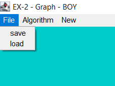
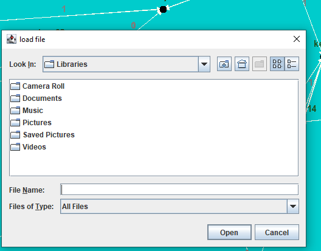
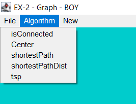
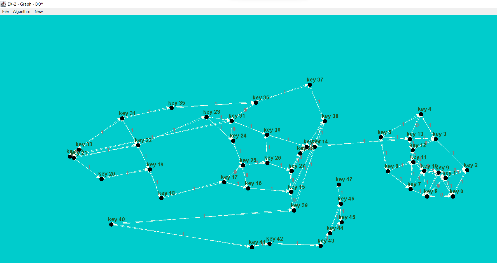
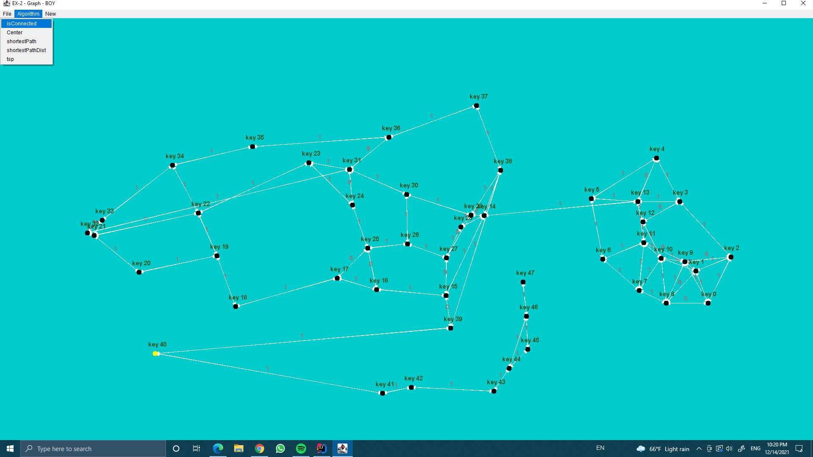

# OOP-Ex2

This project represents a number of algorithms that can be done on a directed graph

1. graph data structure :
    hash map of two hash maps:
    the first key of hashmap --> represent the id of each node by his key,
    the value --> represent another hashmap of the key --> represent nodes' neighbors
    the value of them --> represent array of edges by src and dest.

2. A brief overview of the algorithms that can be done on the directed graph  :
   - isConnected:
     This algorithm checks whether each vertex is connected in a graph
     with one or more edges to the other vertices in the graph
     (work with BFS algorithm).

     
  - shortestPathDist:
    This algorithm checks the shortest distance between two vertices in a graph
    and returns the total weight between those vertices.
  

  - shortestPath:
    This algorithm checks the shortest distance between two vertices in a graph and
    returns the way the vertices pass.

    
  - center: 

  - tsp:
    
    
3. How to use gui: 

    1. First choose from the menu bar  
       
       
       
    2. File --> load ans save
            
        if u choose for load the fallowing will show 
        in this window u need to open a json file of Directed weight graph .
       
       
       
       if u choose for a save  the fallowing will  show 
       and here u need to choose for a place u want to save the result .
       
          
       

3. Algorithm --> isConnected ,  shortestPathDist, shortestPath , center , tsp
    Here u need to choose the algorithm u like to start .  
      

    Note that the yellow vertex in the image above is the center of the graph    

    
    
    4. New --> Add Node , Remove Node , Add Edge  , Remove Edge
        
    
    

      
 

