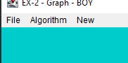
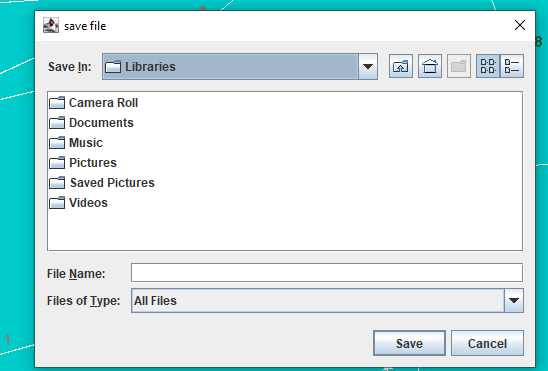

# OOP-Ex2

This project represents a number of algorithms that can be done on a directed graph

1. graph data structure :
    hash map of two hash maps:
    the first key of hashmap --> represent the id of each node by his key,
    the value --> represent another hashmap of the key --> represent nodes' neighbors
    the value of them --> represent array of edges by src and dest.

3. A brief overview of the algorithms that can be done on the directed graph  :
   - isConnected:
     This algorithm checks whether each vertex is connected in a graph
     with one or more edges to the other vertices in the graph
     (work with BFS algorithm).

     
  - shortestPathDist:
    This algorithm checks the shortest distance between two vertices in a graph
    and returns the total weight between those vertices.
  

  - shortestPath:
    This algorithm checks the shortest distance between two vertices in a graph and
    returns the way the vertices pass.

    
  - center:
    This algorithm checks which is the longest path from each vertex,
    and then selects the shortest path from the longest

  - tsp:
    
    
3. How to use gui: 

      
 

